# 🧠 Adaptive AI Technical Interview Platform

<div align="center">

[](https://fastapi.tiangolo.com)
[](https://reactjs.org/)
[](https://langchain-ai.github.io/langgraph/)
[](https://www.trychroma.com/)
[](https://tailwindcss.com/)
[](https://www.python.org/)

**An enterprise-grade, multi-agent AI system that conducts adaptive, curriculum-grounded technical interviews, maintains full conversational memory, evaluates candidate technical depth vs. behavioral conduct, and synthesizes actionable executive feedback.**

[Key Features](#-key-features) • [System Architecture](#-system-architecture) • [Evaluation & Scoring Engine](#-dual-layer-evaluation--scoring-engine) • [Quick Start](#-step-by-step-setup--running-guide) • [API Contract](#-api-specification) • [Testing](#-testing--quality-assurance)

</div>

---

## 🌟 Key Features

- **🤖 Multi-Agent LangGraph State Machine**: Orchestrated stateful multi-agent system coordinating 8 specialized agents with deterministic routing, conversation persistence, and session lifecycle management.
- **📚 Dynamic Curriculum RAG (ChromaDB)**: Embeds the entire curriculum into vector space; retrieves relevant learning milestones based on candidate profiles, experience levels, and targeted topics.
- **🎯 Dynamic Roadmap & Adaptive Probing**: Automatically generates a structured interview plan covering $\ge 4$ curriculum days and $\ge 8$ core questions, dynamically triggering deep-dive probes when candidate answers are shallow or ambiguous.
- **⚖️ Dual-Layer Evaluation Engine**:
  - **Technical Competency (70% Weight)**: Evaluated purely on substantive technical responses across 6 rubrics (Correctness, Depth, Architecture Trade-offs, Reasoning, Practical Understanding).
  - **Behavior & Communication (30% Weight)**: Evaluates complete conversation history across 8 behavioral dimensions (Clarity, Technical Terminology Accuracy, Confidence, Conciseness, Professionalism, Structure, Responsiveness, Overall Presence).
- **🛡️ Conduct & Professionalism Penalty Isolation**: Inappropriate language or evasive behavior incurs dedicated professionalism penalties applied exclusively to the communication score without contaminating pure technical competency.
- **📊 Unified & Coherent Final Feedback**: Generates executive summaries, strengths, actionable gaps, and 30-day customized growth roadmaps perfectly aligned with both technical scores and behavioral observations.
- **💻 Ultra-Responsive Glassmorphic UI**: Built with React, Vite, Tailwind CSS, Lucide icons, live score meters, adaptive probe alerts, and real-time candidate selection.

---

## 🏛️ System Architecture

```mermaid
flowchart TD
    subgraph Initialization ["Turn 1: Initialization & Plan"]
        A[Candidate Selected] --> B[POST /api/interview]
        B --> C[Candidate Analyzer]
        C --> D[Curriculum Retriever RAG]
        D --> E[Interview Planner]
        E --> F[Question Generator]
        F --> G[Deliver Question 1]
    end

    subgraph EvaluationLoop ["Turn N: Answer Evaluation & Progression"]
        H[Candidate Submits Answer] --> I[POST /api/interview]
        I --> J[Memory Manager / SQLite]
        J --> K[Answer Evaluator Node]
        K --> L{Decision Router}
        L -- "Shallow / Ambiguous" --> M[Adaptive Follow-up Probe]
        L -- "Standard / Complete" --> N[Question Generator]
        M --> O{Check Completion}
        N --> O
        O -- "Questions < 8 or Days < 4" --> P[Deliver Next Question]
        O -- "Done: >=8 Qs AND >=4 Days" --> Q[Behavior Evaluator & Feedback Generator]
        Q --> R[Final Structured Report Dashboard]
    end
```



### Specialized Agents Overview

| Agent | Responsibility |
|---|---|
| **Candidate Analyzer** | Parses candidate resume/profile, extracts key signals, target seniority, and prior experience. |
| **Curriculum Retriever** | Queries ChromaDB vector store for curriculum topics, prerequisites, and learning objectives. |
| **Interview Planner** | Generates an adaptive $\ge 4$-day roadmap with target technical milestones and pacing. |
| **Question Generator** | Formulates grounded, scenario-based technical questions matching the planned curriculum days. |
| **Memory Manager** | Synchronizes state with SQLite, maintains conversation turns, question coverage, and score history. |
| **Answer Evaluator** | Scores answers across 6 technical rubrics and detects evasiveness, profanity, or misconceptions. |
| **Adaptive Follow-up Agent** | Dynamically intervenes with targeted follow-up probes when answers lack architectural depth. |
| **Behavior Evaluator & Feedback Generator** | Analyzes complete conversation history across 8 behavioral dimensions and generates final unified feedback. |

---

## 🔬 Dual-Layer Evaluation & Scoring Engine

```
                               Candidate Response Evaluation
                                             │
                      ┌──────────────────────┴──────────────────────┐
                      ▼                                             ▼
          Technical Performance                         Communication & Behavior
         (Pure Technical Answers)                      (8 Behavioral Dimensions)
                      │                                             │
      • Correctness & Accuracy (0-100)              1. Communication Clarity (1-10)
      • Depth & Trade-offs (0-100)                  2. Technical Terminology Accuracy (1-10)
      • Reasoning & Architecture (0-100)            3. Confidence Level (1-10)
      • Practical Implementation (0-100)            4. Conciseness & Precision (1-10)
                      │                             5. Professionalism & Tone (1-10)
                      │                             6. Answer Structure (STAR) (1-10)
                      │                             7. Question Responsiveness (1-10)
                      │                             8. Overall Interview Presence (1-10)
                      ▼                                             │
           Technical Score (70%)                     ⚠️ Conduct Penalty Applied (if any)
                      │                                             ▼
                      │                                 Communication Score (30%)
                      │                                             │
                      └──────────────────────┬──────────────────────┘
                                             ▼
                               Overall Interview Score
                 Formula: round(0.70 * Technical + 0.30 * Communication)
```

### Scoring Logic & Formulas

1. **Pure Technical Score**:
   $$\text{Technical Score} = \text{round}\left(\frac{1}{N_{\text{substantive}}} \sum_{i=1}^{N_{\text{substantive}}} \text{Score}_i\right)$$
   *Note: Inappropriate/abusive turns do not contaminate the candidate's pure technical score.*

2. **Communication & Behavior Score**:
   $$\text{Communication Score} = \text{round}\left(\frac{1}{8} \sum_{d=1}^{8} \text{Dimension Score}_d \times 10\right)$$
   *Penalties for unprofessional conduct (e.g. -25 points) directly reduce the behavior score.*

3. **Composite Overall Score**:
   $$\text{Overall Score} = \text{round}\left(0.70 \times \text{Technical Score} + 0.30 \times \text{Communication Score}\right)$$

---

## 🚀 Step-by-Step Setup & Running Guide

### Prerequisites
- **Python 3.11+**
- **Node.js 18+** & **npm**
- **Google Gemini API Key** (or LLM API Key)

---

### Option 1: Local Development (Recommended)

#### 1. Clone the Repository
```bash
git clone https://github.com/apragam80-sys/The-Interview-Agent.git
cd The-Interview-Agent
```

#### 2. Backend Setup
```bash
# Navigate to backend directory
cd backend

# Create virtual environment
python -m venv venv

# Activate virtual environment
# On Windows (PowerShell):
.\venv\Scripts\Activate.ps1
# On Linux/macOS:
source venv/bin/activate

# Install dependencies
pip install -r requirements.txt

# Configure environment variables
# Copy .env.example to .env and set your GEMINI_API_KEY
cp ../.env.example .env

# Run FastAPI backend server
python run_server.py
```
> 🌐 Backend will be running at `http://localhost:8000` (API Docs: `http://localhost:8000/docs`).

#### 3. Frontend Setup
Open a new terminal window:
```bash
# Navigate to frontend directory
cd frontend

# Install dependencies
npm install

# Start Vite dev server
npm run dev
```
> 💻 Frontend will be running at `http://localhost:5173`.

---

### Option 2: Run via Docker Compose

Run the entire full-stack application with a single command:

```bash
docker-compose up --build
```
- **Frontend**: `http://localhost:3000`
- **Backend API**: `http://localhost:8000`

---

## 📡 API Specification

### `POST /api/interview`

Primary stateful endpoint powering the interview loop.

#### Turn 1: Interview Initialization
**Request:**
```json
{
  "sessionId": "session-101",
  "candidate": {
    "id": "CAND-001",
    "name": "Sarah Johnson",
    "experience_years": 3,
    "current_role": "Backend Engineer",
    "resume_summary": "Hands-on experience with FastAPI, PostgreSQL, and basic vector search."
  }
}
```

**Response:**
```json
{
  "reply": "Welcome Sarah! Let's start with Day 1: How do you design an embedding pipeline for semantic search?",
  "done": false,
  "coveredDays": [1],
  "totalQuestions": 1,
  "isFollowUp": false,
  "score": null,
  "averageScore": null
}
```

#### Turn N: Candidate Progression
**Request:**
```json
{
  "sessionId": "session-101",
  "message": "We use sentence-transformers to generate dense embeddings and store them in ChromaDB with cosine indexing."
}
```

**Response:**
```json
{
  "reply": "Good explanation. How do you handle chunk size and overlap trade-offs when indexing large PDF manuals?",
  "done": false,
  "coveredDays": [1, 2],
  "totalQuestions": 2,
  "isFollowUp": true,
  "score": 85,
  "averageScore": 85
}
```

#### Final Turn: Evaluation Completion
When $\text{Questions} \ge 8$ and $\text{Covered Days} \ge 4$, the platform concludes and returns comprehensive feedback:

```json
{
  "reply": "Thank you for completing the interview! Your comprehensive evaluation report is ready.",
  "done": true,
  "feedback": {
    "summary": "Sarah demonstrated strong technical knowledge in AI vector search and backend systems. Communication was clear with good structured reasoning.",
    "strengths": [
      "Deep understanding of vector embeddings and ChromaDB indexing.",
      "Clear explanation of chunking strategies."
    ],
    "gaps": [
      "Could expand on RAG re-ranking models under high concurrency."
    ],
    "next": [
      "Practice multi-agent orchestration patterns.",
      "Explore hybrid dense-sparse search implementations."
    ],
    "technical_score": 82,
    "communication_score": 78,
    "overall_score": 81,
    "behavior": {
      "communication_clarity": { "score": 8.0, "reasoning": "Well-structured explanations." },
      "technical_communication": { "score": 8.5, "reasoning": "Accurate terminology." },
      "professionalism": { "score": 9.0, "reasoning": "Polite and responsive throughout." }
    }
  }
}
```

---

## 🧪 Testing & Quality Assurance

The system is validated by an automated test suite with **100% pass rate** across all scenarios:

```bash
cd backend
python -m unittest discover -s tests
```

### Test Suites Included:
- **`test_behavior_evaluation.py`**: Validates 8-dimension scoring, candidate separation (High Tech/Low Comm, Low Tech/High Comm), and report coherence.
- **`test_candidate_coverage.py`**: Tests complete end-to-end interview journeys across all candidate profiles, verifying strict $\le 8$ question caps and $\ge 4$ day curriculum coverage.
- **`test_adaptive_behavior.py`**: Tests dynamic deep-dive follow-up trigger logic for shallow vs. robust answers.
- **`test_api_contract.py`**: Verifies strict adherence to the API contract schemas.

---

## 📁 Repository Structure

```
The-Interview-Agent/
├── .env.example                      # Template for environment variables
├── .gitignore                        # Standard ignore rules (Python, Node, DBs)
├── Dockerfile.backend                # Backend container config
├── Dockerfile.frontend               # Frontend container config
├── docker-compose.yml                # Multi-service orchestration
├── README.md                         # Main documentation
│
├── data/
│   ├── candidates.json               # Seed candidate profiles
│   └── curriculum.json               # 15-day AI Engineering curriculum
│
├── backend/
│   ├── app/
│   │   ├── main.py                   # FastAPI app (POST /api/interview)
│   │   ├── config.py                 # Configuration & settings
│   │   ├── llm.py                    # Gemini LLM initialization & fallback
│   │   ├── models/schemas.py         # Pydantic schemas & response models
│   │   ├── db/database.py            # SQLite session storage
│   │   ├── graph/
│   │   │   ├── state.py              # LangGraph InterviewState
│   │   │   └── workflow.py           # LangGraph State Machine
│   │   ├── services/
│   │   │   ├── behavior_evaluator.py # 8-dimension behavior scoring service
│   │   │   ├── chroma_service.py     # ChromaDB vector retriever
│   │   │   └── embedding_service.py  # Dense embedding generation
│   │   └── agents/
│   │       ├── candidate_analyzer.py # Profile signal extraction
│   │       ├── curriculum_retriever.py # RAG curriculum query
│   │       ├── interview_planner.py  # Dynamic roadmap creation
│   │       ├── question_generator.py # Context-aware question generation
│   │       ├── answer_evaluator.py   # Multi-rubric & penalty scoring
│   │       ├── adaptive_followup.py  # Dynamic probe generator
│   │       ├── memory_manager.py     # State & session synchronization
│   │       └── feedback_generator.py # Executive report synthesis
│   └── tests/                        # Comprehensive unit & integration tests
│
└── frontend/
    ├── src/
    │   ├── App.jsx                   # Main React app & view state
    │   ├── components/
    │   │   ├── CandidateSelector.jsx # Candidate selection modal
    │   │   ├── ChatInterface.jsx     # Live chat feed & penalty badges
    │   │   ├── ProgressTracker.jsx   # Live score meter & curriculum tracker
    │   │   └── FeedbackDashboard.jsx # Final executive evaluation dashboard
    │   ├── services/api.js           # API communication client
    │   └── index.css                 # Custom glassmorphism & styling
    ├── package.json
    └── tailwind.config.js
```

---

## 👥 Contributors & License

Developed with ❤️ for the AI Engineering Hackathon.

Licensed under the [MIT License](LICENSE).
