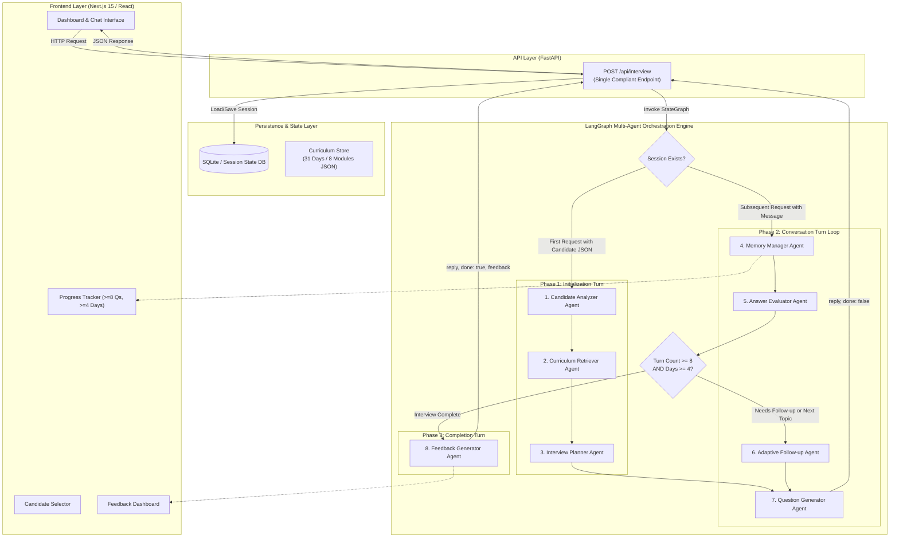
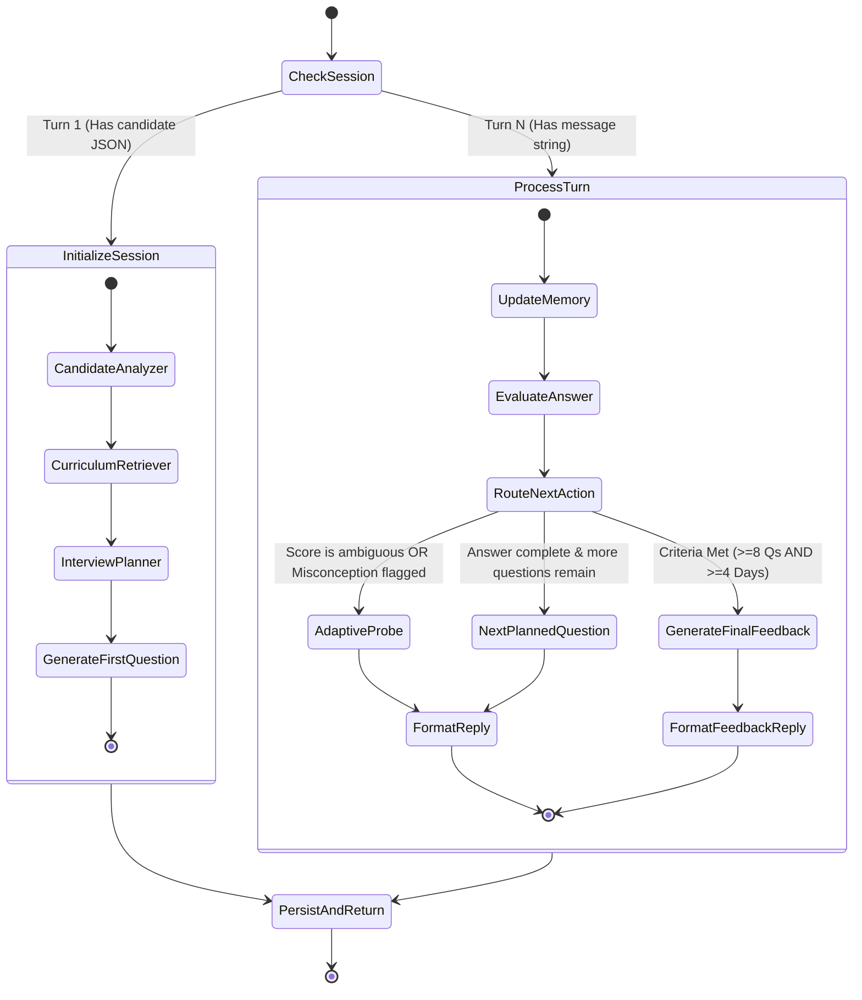

# Production-Grade Architecture Blueprint: Adaptive AI Interview Platform

## Executive Summary
This architectural specification provides the end-to-end blueprint for a hackathon-winning, production-grade **Adaptive AI Technical Interview Platform**. The system is built around a single strictly-compliant API endpoint (`POST /api/interview`), an 8-agent **LangGraph** state machine, persistent SQLite session memory, and a clean Next.js/React frontend with real-time progress tracking and post-interview feedback dashboards.

---

## A. System Architecture (Mermaid)



---

## B. Folder Structure

```
vidocothan/
├── data/
│   ├── curriculum.json             # 31-day, 8-module AI curriculum
│   └── candidates.json             # 20 candidate benchmark profiles
├── backend/
│   ├── app/
│   │   ├── __init__.py
│   │   ├── config.py               # Environment & LLM settings (API Keys, model choice)
│   │   ├── models/
│   │   │   ├── __init__.py
│   │   │   └── schemas.py          # Pydantic schemas (Request, Response, Feedback, State)
│   │   ├── agents/
│   │   │   ├── __init__.py
│   │   │   ├── candidate_analyzer.py # Agent 1: Profile & Weakness Detection
│   │   │   ├── curriculum_retriever.py # Agent 2: Module/Day Objectives Search
│   │   │   ├── interview_planner.py  # Agent 3: Roadmap (>=8 Qs, >=4 Days, Progression)
│   │   │   ├── memory_manager.py     # Agent 4: Session History & State Synchronization
│   │   │   ├── answer_evaluator.py   # Agent 5: 6-Dimension Response Rubrics
│   │   │   ├── adaptive_followup.py  # Agent 6: Intelligent Probe Generation
│   │   │   ├── question_generator.py # Agent 7: Core Curriculum Question Synthesizer
│   │   │   └── feedback_generator.py # Agent 8: Final Summary, Strengths, Gaps, Next
│   │   ├── db/
│   │   │   ├── __init__.py
│   │   │   └── database.py         # SQLite Session Store & Persistence Models
│   │   ├── graph/
│   │   │   ├── __init__.py
│   │   │   ├── state.py            # LangGraph TypedDict InterviewState
│   │   │   └── workflow.py         # LangGraph StateGraph builder & compiled runnable
│   │   ├── llm.py                  # Clean LangChain ChatModel factory (Gemini/OpenAI/Groq)
│   │   └── main.py                 # FastAPI Application exposing ONLY POST /api/interview
│   ├── tests/
│   │   ├── __init__.py
│   │   ├── test_api_contract.py    # Strict API specification validation
│   │   ├── test_candidate_flows.py # Validates all 20 candidate profiles end-to-end
│   │   └── test_steerability.py    # Live steer 20-minute simulation test
│   ├── requirements.txt
│   └── run_server.py
├── frontend/
│   ├── public/
│   ├── src/
│   │   ├── components/
│   │   │   ├── CandidateSelector.jsx # Candidate picker (CAND-001 to CAND-020)
│   │   │   ├── ChatInterface.jsx     # Modern conversational stream with badges
│   │   │   ├── ProgressTracker.jsx   # Questions count, Days covered, Difficulty curve
│   │   │   └── FeedbackDashboard.jsx # Post-interview strengths, gaps, next steps
│   │   ├── services/
│   │   │   └── api.js                # Single POST /api/interview fetch wrapper
│   │   ├── App.jsx                   # Main layout container (Dashboard)
│   │   ├── index.css                 # Tailwind CSS styles
│   │   └── main.jsx
│   ├── package.json
│   ├── vite.config.js
│   └── tailwind.config.js
├── Dockerfile.backend
├── Dockerfile.frontend
├── docker-compose.yml
├── AI_USAGE_LOG.md
└── README.md
```

---

## C. Agent Responsibilities

| Agent | Responsibility | Core Logic & Heuristics |
| :--- | :--- | :--- |
| **1. Candidate Analyzer** | Ingests candidate profile; extracts learning signals, skipped missions, and high-attempt missions (&ge;3 attempts). | Classifies baseline difficulty (`JUNIOR`, `MID`, `SENIOR`, `PRINCIPAL`), flags vulnerable topics (gaps to test), and identifies strengths. |
| **2. Curriculum Retriever** | Queries `curriculum.json` to extract relevant days, learning objectives, and tools. | Focuses on days where candidate showed weakness or skipped missions, while balancing prerequisite foundational days. |
| **3. Interview Planner** | Generates an 8+ question roadmap covering &ge;4 distinct curriculum days. | Enforces difficulty progression: Questions 1-2 (*Easy / Foundations*), 3-5 (*Medium / Core RAG & APIs*), 6-8+ (*Hard / Agents, Guardrails & Production*). |
| **4. Memory Manager** | Tracks conversation turn history, scores per question, asked topics, and days covered in SQLite. | Ensures state continuity between HTTP requests using `sessionId`. Manages context window pruning if history grows. |
| **5. Answer Evaluator** | Evaluates candidate answers on 6 dimensions: Correctness, Reasoning, Depth, Communication, Examples, Practical Knowledge. | Outputs a score (0-100), detects specific misconceptions, missing nuances, or high confidence without substance. |
| **6. Adaptive Follow-up** | Decides whether candidate's response warrants an immediate follow-up probe. | Triggers if score is ambiguous (40-70%), contains unverified claims/buzzwords, or reveals an interesting edge-case. |
| **7. Question Generator** | Synthesizes grounded, professional interview questions anchored in the planned curriculum objectives. | Formats questions with real-world scenarios (e.g. debugging ChromaDB index latency, handling LLM tool-calling timeouts). |
| **8. Feedback Generator** | Synthesizes full session performance into the strict JSON schema. | Produces `summary` (string), `strengths` (string[]), `gaps` (string[]), and `next` (string[]) actionable items. |

---

## D. LangGraph Flow



### State Graph Schema (`InterviewState`)
```python
class InterviewState(TypedDict):
    session_id: str
    candidate_profile: Optional[dict]
    difficulty_level: str
    target_days: list[int]
    planned_roadmap: list[dict]
    current_question_index: int
    current_question: Optional[dict]
    is_follow_up: bool
    conversation_history: list[dict]
    evaluations: list[dict]
    covered_days: list[int]
    total_questions_asked: int
    is_complete: bool
    final_feedback: Optional[dict]
    latest_reply: str
```

---

## E. Database Design (SQLite Session Store)

A lean, zero-configuration SQLite database (`interview_sessions.db`) stores interview sessions and state snapshots:

```sql
-- Core Session Table
CREATE TABLE IF NOT EXISTS interview_sessions (
    session_id TEXT PRIMARY KEY,
    candidate_id TEXT,
    candidate_name TEXT,
    job_role TEXT,
    status TEXT NOT NULL DEFAULT 'IN_PROGRESS', -- 'IN_PROGRESS', 'COMPLETED'
    difficulty_level TEXT NOT NULL,
    total_questions INTEGER DEFAULT 0,
    covered_days_json TEXT NOT NULL DEFAULT '[]',
    state_json TEXT NOT NULL,                  -- Serialized LangGraph state
    created_at TIMESTAMP DEFAULT CURRENT_TIMESTAMP,
    updated_at TIMESTAMP DEFAULT CURRENT_TIMESTAMP
);

-- Message & Turn History Table
CREATE TABLE IF NOT EXISTS interview_turns (
    id INTEGER PRIMARY KEY AUTOINCREMENT,
    session_id TEXT NOT NULL,
    turn_index INTEGER NOT NULL,
    question_text TEXT NOT NULL,
    curriculum_day INTEGER NOT NULL,
    difficulty TEXT NOT NULL,
    is_follow_up BOOLEAN DEFAULT 0,
    candidate_answer TEXT,
    evaluation_json TEXT,                     -- Scores & feedback on answer
    created_at TIMESTAMP DEFAULT CURRENT_TIMESTAMP,
    FOREIGN KEY(session_id) REFERENCES interview_sessions(session_id)
);
```

---

## F. Tech Stack

| Component | Technology | Rationale |
| :--- | :--- | :--- |
| **Backend Framework** | **FastAPI** (Python 3.11+) | Asynchronous, fast Pydantic schema validation, clean REST architecture. |
| **Multi-Agent Orchestrator** | **LangGraph** & **LangChain** | Industry standard for cyclical multi-agent workflows, checkpointing, and deterministic state transitions. |
| **LLM Provider** | **Google Gemini 2.5 Pro / Flash** (or OpenAI GPT-4o / Groq) | High reasoning quality, fast response time, structured output reliability. |
| **Database** | **SQLite** | Zero latency, ACID compliant, embedded, 100% portable for hackathons. |
| **Frontend Framework** | **React / Next.js** (Vite / Next.js) | Fast development, reactive state, modular UI component tree. |
| **Styling & UI** | **Tailwind CSS** + **Lucide Icons** | Clean, responsive, modern dark mode with zero CSS bloat. |

---

## G. Implementation Plan

```
Phase 1: Foundation (30 mins)
├── Load curriculum.json and candidates.json
├── Setup SQLite database schema and connection helper
└── Setup FastAPI app skeleton with POST /api/interview

Phase 2: LangGraph State & Core Agents (60 mins)
├── Implement Candidate Analyzer (Signal parser, difficulty selector)
├── Implement Curriculum Retriever (Indexed day/module lookup)
├── Implement Interview Planner (Roadmap builder: 8+ Qs, 4+ Days, Progression)
├── Implement Question Generator & Adaptive Follow-up
├── Implement Answer Evaluator & Memory Manager
└── Implement Feedback Generator

Phase 3: StateGraph Assembly & API Binding (30 mins)
├── Connect agents into LangGraph workflow
├── Bind LangGraph state transitions to POST /api/interview
└── Ensure exact compliance with technical-spec(1).md contract

Phase 4: Frontend Development (45 mins)
├── Candidate Selector (CAND-001 through CAND-020 preview)
├── Interactive Chat Interface
├── Live Progress Tracker (Questions >=8, Days Covered >=4)
└── Feedback Dashboard (Summary, Strengths, Gaps, Next)

Phase 5: Automated Testing & Verification (20 mins)
├── Unit tests for API contract
├── Benchmark test iterating all 20 candidate profiles
└── Live Steer 20-minute rapid extension test
```

---

## H. Deployment Plan

1. **Docker Containerization**:
   - Backend: Multi-stage `Dockerfile.backend` with Python 3.11-slim, Uvicorn on port 8000.
   - Frontend: `Dockerfile.frontend` with Node 20-alpine, Vite/Nginx on port 3000.
   - `docker-compose.yml` for 1-command startup: `docker-compose up --build`.

2. **Cloud Hosting**:
   - **Backend**: Render / Railway / Google Cloud Run (exposing `POST /api/interview`).
   - **Frontend**: Vercel / Netlify / Render Static Site.

---

## I. Testing Strategy

1. **API Contract Test (`test_api_contract.py`)**:
   - Verifies turn 1 accepts `{"sessionId": "...", "candidate": {...}}` &rarr; returns `{"reply": "...", "done": false}`.
   - Verifies turn N accepts `{"sessionId": "...", "message": "..."}` &rarr; returns `{"reply": "...", "done": false}`.
   - Verifies completion returns `{"reply": "...", "done": true, "feedback": {"summary": "...", "strengths": [...], "gaps": [...], "next": [...]}}`.

2. **20-Candidate Comprehensive Validation (`test_candidate_flows.py`)**:
   - Simulates complete interview sessions across all 20 candidates in `candidates.json`.
   - Validates that every candidate receives at least 8 questions.
   - Validates that every interview covers at least 4 unique curriculum days.
   - Validates that final feedback contains non-empty summary, strengths, gaps, and next arrays.

3. **Adaptive Follow-up Triggering Test**:
   - Injects vague answers and validates that the agent issues a follow-up probe before moving to the next topic.

---

## J. Requirement-to-Implementation Traceability Matrix

| Specification Requirement | Implementation Mechanism | Verification Point |
| :--- | :--- | :--- |
| **Expose ONLY `POST /api/interview`** | `backend/app/main.py` defines only `@app.post("/api/interview")`. | `test_api_contract.py` validates single route exposure. |
| **Maintain session with `sessionId`** | `MemoryManager` + SQLite `interview_sessions` table keyed on `sessionId`. | State persists across multiple consecutive HTTP POST requests. |
| **Minimum 8 questions** | `InterviewPlanner` schedules 8+ roadmap slots; `Decision` node checks `total_questions_asked >= 8`. | Loop will not terminate until `total_questions_asked >= 8`. |
| **Minimum 4 curriculum days** | `InterviewPlanner` selects $\ge 4$ unique days; `MemoryManager` records `covered_days`. | Loop will not terminate until `len(set(covered_days)) >= 4`. |
| **Curriculum grounding** | `CurriculumRetriever` indexes all 31 days, 8 modules, objectives, and tools from `curriculum.json`. | All questions explicitly link to a valid day number and objective. |
| **Candidate profile analysis** | `CandidateAnalyzer` evaluates completed/skipped missions, attempts, and signals from `candidates.json`. | Targeted questions focus on candidate's weak areas and skipped days. |
| **Adaptive follow-up questions** | `AdaptiveFollowUp` agent evaluates answer depth and flags ambiguous/vague answers. | Probe question generated before advancing topic index. |
| **Structured feedback output** | `FeedbackGenerator` outputs exact JSON: `{ "summary": "...", "strengths": [...], "gaps": [...], "next": [...] }`. | Schema validation via Pydantic `FeedbackSchema`. |
| **Live Steer Extensibility (<20 mins)** | Modular LangGraph nodes + Pydantic `InterviewState`. | Adding a new agent/node requires only adding 1 Python function and 1 edge in `workflow.py`. |
